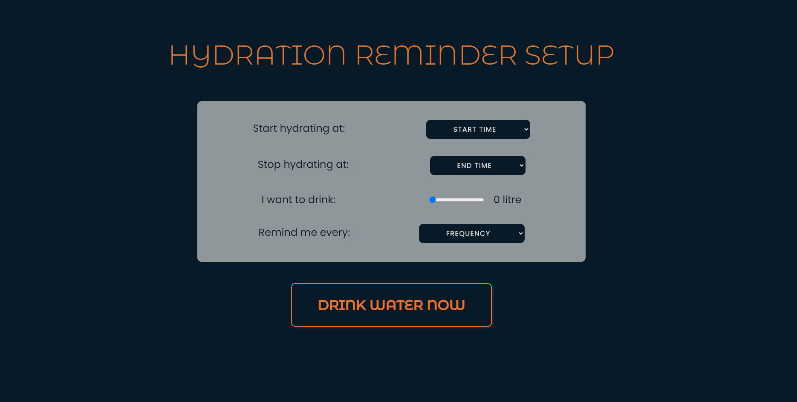

# Hydration App

An app to help remind you to drink more water in your day. 
Enter the start time, end time and amount of water and the app will remind you at set intervals to drink water. 
  
<video controls src="public/screenshot-1.mp4" title="Title" autoplay></video>

## Getting Started

These instructions will give you a copy of the project up and running on
your local machine for development and testing purposes. See deployment
for notes on deploying the project on a live system.

### Sample Tests

Click the start button - shows the input screen

    Give an example

### Style test

Checks if the best practices and the right coding style has been used.

    Give an example

## Deployment

Add additional notes to deploy this on a live system

## Built With

  - [Contributor Covenant](https://www.contributor-covenant.org/) - Used
    for the Code of Conduct
  - [Creative Commons](https://creativecommons.org/) - Used to choose
    the license

## Contributing

Please read [CONTRIBUTING.md](CONTRIBUTING.md) for details on our code
of conduct, and the process for submitting pull requests to us.

## Versioning

We use [Semantic Versioning](http://semver.org/) for versioning. For the versions
available, see the [tags on this
repository](https://github.com/PurpleBooth/a-good-readme-template/tags).

## Authors

  - **Billie Thompson** - *Provided README Template* -
    [PurpleBooth](https://github.com/PurpleBooth)

See also the list of
[contributors](https://github.com/PurpleBooth/a-good-readme-template/contributors)
who participated in this project.

## License

This project is licensed under the [CC0 1.0 Universal](LICENSE.md)
Creative Commons License - see the [LICENSE.md](LICENSE.md) file for
details

## Acknowledgments

  - Hat tip to anyone whose code is used
  - Inspiration
  - etc
